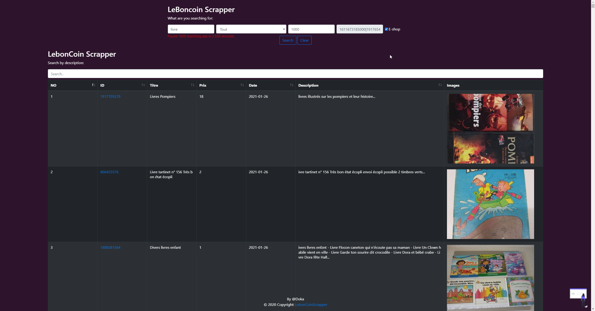
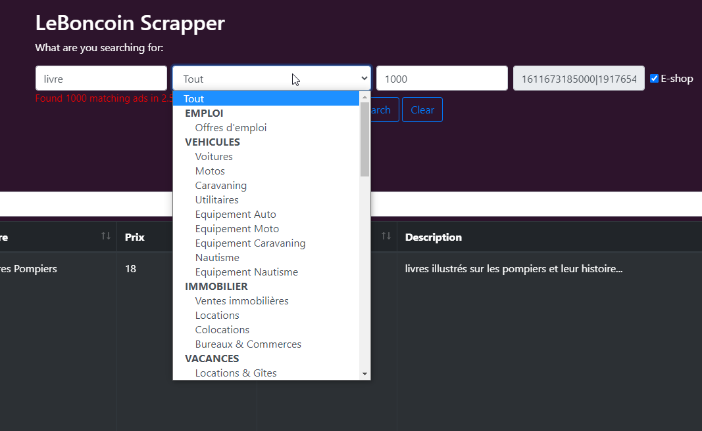

# LebonCoinScrapper

LeBonCoinScrapper is a powerful and very simple scrapper yet limited with the current UI (not all UI filters exists for now, but the endpoints and query have them.).
Feel free to implements your own UI, so you can filter by region, price...

It can achieve excellent speed such as 1000 requested items take only 2.5s to query. 

## Custom features
You can implements whatever you want.

### Exemple: E-SHOP
This tool also provide an unique tool that allows you to only get shippable items.

## Limits
Be aware that query exceding 10k items may use too much memory on your server, 1000 requested items represents roughly 5mb of pure JSON. You can increase the memory_limit of your PHP server.

Captcha, not much to say here.

## Main page

